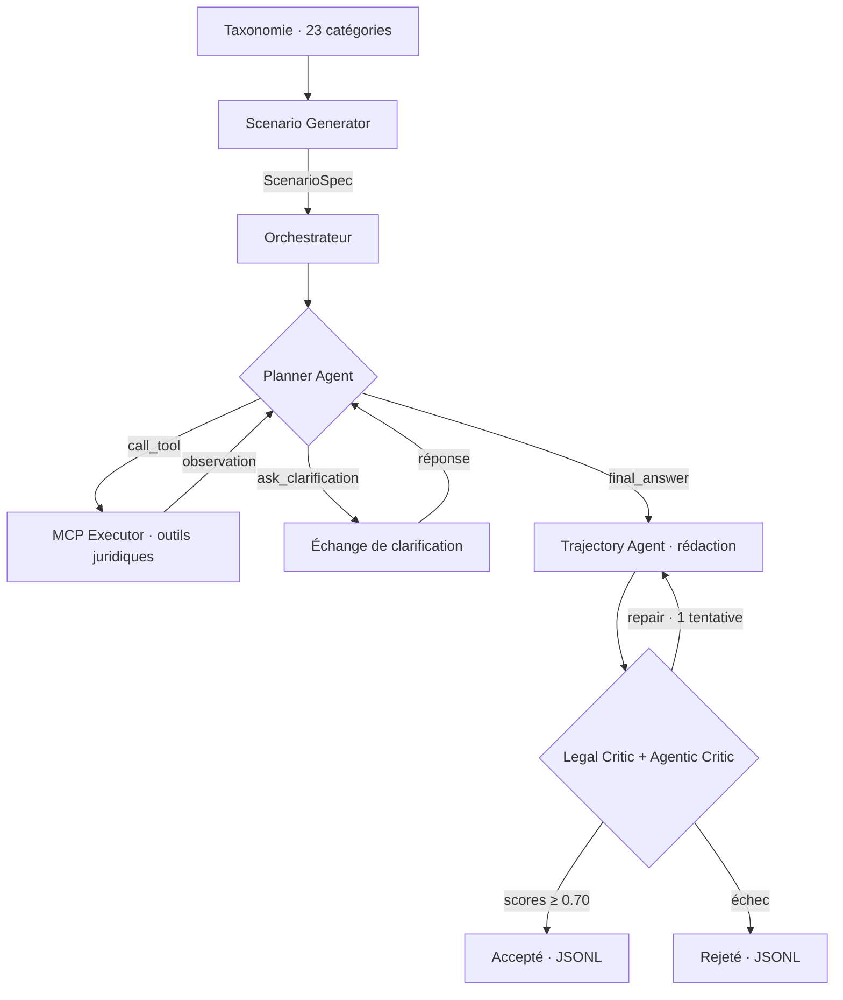
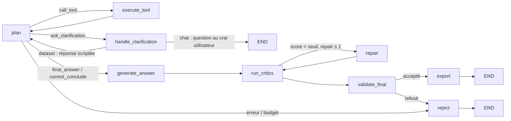

# Phase 1 — Data Preparation

This document explains how Phase 1 generates the training dataset for LexiorGPT:
what the pipeline does at each stage, the modules involved, and the design
decisions behind them.

Phase 1 produces two kinds of training data:

- **Agentic trajectories** — multi-turn research sessions where the model
  plans, calls legal tools, reads the results, and builds a grounded answer.
  This is the primary pipeline, described below.
- **Legacy single-turn CoT** — one-shot IRAC resolutions from pre-fetched
  law text (stages 1–6, described further down).

Both share the same identity alignment set and formatting/audit stages.

---

## Agentic Generation Pipeline

The agentic pipeline generates training trajectories where the model learns to
**plan, search, and reason** over live legal databases using MCP tools. Each
trajectory is a complete research session: the model decides which tools to
call, reads the results, and writes a response grounded exclusively in the
sources it retrieved — or asks for clarification when essential facts are
missing. Two independent critics evaluate the result before accepting it.

### Architecture



### Components

| Component | Role |
|---|---|
| **Taxonomy** | 23 legal question categories (precise article, thematic search, concrete case, clarification, simulated failure…) with expected tool routes and configurable sampling weights. |
| **Scenario Generator** | Produces a realistic French legal question from the sampled category. Online: calls the Teacher LLM. Offline: uses deterministic fixtures. |
| **Planner Agent** | Planning loop: reasons inside a `<thinking>` block, decides the next action (`call_tool`, `ask_clarification`, or `final_answer`). Guards correct jurisdiction, duplicates, and invalid routes. Extracts `SearchIntent` from the thinking text to choose focused keywords and `doc_type`. |
| **MCP Executor** | Executes tool calls via the MCP protocol — CanLII/A2AJ (federal), LegisQuébec (Quebec), SOQUIJ (jurisprudence). Normalizes, truncates, and extracts citations from responses. |
| **Trajectory Agent** | Writes the final response as natural legal prose, exclusively from retrieved sources. For precise-article categories, returns the official text verbatim. |
| **Legal Critic** | Evaluates legal fidelity: correct jurisdiction, rule accuracy, grounded citations, no unsupported claims. Score ≥ 0.70 required. |
| **Agentic Critic** | Evaluates tool routing quality: correct tool sequence, no loops, no unnecessary calls, proper clarification handling. Score ≥ 0.70 required. |

### How a Trajectory is Built

1. **Scenario sampling.** The CLI picks the category most behind its
   acceptance quota. The Scenario Generator produces a `ScenarioSpec` with
   a user query, expected route, jurisdiction, and optional clarification
   answer.

2. **Planning loop.** The Orchestrator initializes a `ResearchState` and
   enters the Planner loop. Each iteration: the Planner reasons in a
   `<thinking>` block, then returns a decision.
   - `call_tool` → the MCP Executor runs the tool and feeds the observation
     back to the Planner.
   - `ask_clarification` → a clarification question is appended, the
     scenario's pre-written answer is injected, and planning resumes.
   - `final_answer` → the loop exits.

3. **Final answer.** The Trajectory Agent writes a prose response using only
   the evidence collected during the planning loop. The answer cites specific
   articles and decisions retrieved by the tools.

4. **Dual evaluation.** The Legal Critic and Agentic Critic independently
   score the trajectory. Both must accept (score ≥ 0.70). If one rejects,
   the Trajectory Agent attempts a single repair guided by the critic's
   feedback. If the repair fails, the trajectory is rejected.

5. **Storage.** Accepted trajectories are appended to the run's JSONL file.
   Rejected trajectories are stored separately with their rejection reasons.
   A manifest records quotas, costs, and category distribution.

### Example 1 — Law Search (`recherche_theme_ccq`)

Route: `semantic_search_ccq` → `get_ccq_articles`

---

> **Utilisateur**
>
> Quels articles du Code civil du Québec encadrent les vices cachés lors de la
> vente d'un bien?

---

> **Réflexion**
>
> Type de demande : recherche thématique dans le CCQ
> Juridiction : Québec
> Informations manquantes : aucune
> Sources nécessaires : articles du CCQ sur la garantie de qualité et les vices cachés
> Prochaine action : recherche sémantique dans le CCQ

**Appel** → `semantic_search_ccq`

```json
{"query": "vices cachés garantie qualité vente bien"}
```

> **Résultat de l'outil**
>
> **Art. 1726.** Le vendeur est tenu de garantir à l'acheteur que le bien et
> ses accessoires sont, lors de la vente, exempts de vices cachés qui le
> rendent impropre à l'usage auquel on le destine ou qui diminuent tellement
> son utilité que l'acheteur ne l'aurait pas acheté, ou n'aurait pas donné si
> haut prix, s'il les avait connus.
>
> **Art. 1727.** Si le bien périt par suite d'un vice caché qui existait lors
> de la vente, la perte échoit au vendeur, lequel est tenu à la restitution
> du prix.
>
> **Art. 1739.** L'acheteur qui constate que le bien est atteint d'un vice
> doit, par écrit, le dénoncer au vendeur dans un délai raisonnable depuis sa
> découverte.
>
> *legisquebec.gouv.qc.ca/fr/document/lc/CCQ-1991*

---

> **Réflexion**
>
> Les articles 1726, 1727 et 1739 sont pertinents. Je dois récupérer le texte
> officiel complet des articles 1726 à 1739 pour fonder ma réponse sur les
> sources primaires.
> Prochaine action : récupérer les articles 1726 à 1739 du CCQ

**Appel** → `get_ccq_articles`

```json
{"start_article": 1726, "end_article": 1739}
```

> **Résultat de l'outil**
>
> **Art. 1726.** Le vendeur est tenu de garantir à l'acheteur que le bien et
> ses accessoires sont, lors de la vente, exempts de vices cachés qui le
> rendent impropre à l'usage auquel on le destine ou qui diminuent tellement
> son utilité que l'acheteur ne l'aurait pas acheté, ou n'aurait pas donné si
> haut prix, s'il les avait connus. Il n'est, cependant, pas tenu de garantir
> le vice caché connu de l'acheteur ni le vice apparent; est apparent le vice
> qui peut être constaté par un acheteur prudent et diligent sans avoir besoin
> de recourir à un expert.
>
> **Art. 1728.** Si le vendeur connaissait le vice caché ou ne pouvait
> l'ignorer, il est tenu, outre la restitution du prix, de tous les
> dommages-intérêts soufferts par l'acheteur.
>
> **Art. 1739.** L'acheteur qui constate que le bien est atteint d'un vice
> doit, par écrit, le dénoncer au vendeur dans un délai raisonnable depuis sa
> découverte. Ce délai commence à courir, lorsque le vice apparaît
> graduellement, du jour où l'acheteur a pu en soupçonner la gravité et
> l'étendue.
>
> *legisquebec.gouv.qc.ca/fr/document/lc/CCQ-1991*

---

> **Réponse finale**
>
> La garantie contre les vices cachés est encadrée par les articles 1726 à
> 1739 du Code civil du Québec. L'article 1726 impose au vendeur de garantir
> que le bien vendu est exempt de vices cachés qui le rendent impropre à
> l'usage auquel on le destine, ou qui diminuent tellement son utilité que
> l'acheteur ne l'aurait pas acheté à ce prix s'il les avait connus.
>
> Pour qu'un vice soit qualifié de « caché », il doit répondre à trois
> conditions : être suffisamment grave, être inconnu de l'acheteur au moment
> de la vente, et ne pas être apparent lors d'un examen raisonnable par un
> acheteur prudent et diligent (art. 1726 al. 2). Le vendeur est tenu à cette
> garantie même s'il ignorait lui-même le vice (art. 1727), mais s'il le
> connaissait ou ne pouvait l'ignorer, il est tenu en plus de tous les
> dommages-intérêts (art. 1728).
>
> L'acheteur qui découvre un vice peut réclamer la diminution du prix de vente
> ou, si le vice rend le bien impropre à son usage, la résolution de la vente.
> Il doit toutefois dénoncer le vice par écrit au vendeur dans un délai
> raisonnable depuis sa découverte (art. 1739), faute de quoi il pourrait
> perdre ses recours.
>
> *Source : Code civil du Québec, RLRQ, c. CCQ-1991, art. 1726–1739 —
> legisquebec.gouv.qc.ca*

**Verdict** : Accepté — Legal Critic : 0.85, Agentic Critic : 0.90

### Example 2 — Civil Case with Court Decision (`cas_civil_quebecois`)

Route: `semantic_search_ccq` → `get_ccq_articles` → `search_quebec_jurisprudence`

---

> **Utilisateur**
>
> J'ai acheté une maison au Québec et j'ai découvert un problème de fondation
> trois mois après la vente. Le vendeur refuse de payer les réparations. Quels
> sont mes recours?

---

> **Réflexion**
>
> Type de demande : cas civil québécois concret
> Juridiction : Québec
> Informations manquantes : aucune — les faits essentiels sont fournis
> Sources nécessaires : articles du CCQ sur la garantie de qualité + jurisprudence québécoise sur les vices cachés immobiliers
> Prochaine action : recherche sémantique dans le CCQ

**Appel** → `semantic_search_ccq`

```json
{"query": "vice caché immeuble recours acheteur garantie vendeur"}
```

> **Résultat de l'outil**
>
> **Art. 1726.** Le vendeur est tenu de garantir à l'acheteur que le bien et
> ses accessoires sont, lors de la vente, exempts de vices cachés qui le
> rendent impropre à l'usage auquel on le destine [...]
>
> **Art. 1728.** Si le vendeur connaissait le vice caché ou ne pouvait
> l'ignorer, il est tenu, outre la restitution du prix, de tous les
> dommages-intérêts soufferts par l'acheteur.
>
> **Art. 1739.** L'acheteur qui constate que le bien est atteint d'un vice
> doit, par écrit, le dénoncer au vendeur dans un délai raisonnable [...]
>
> *legisquebec.gouv.qc.ca/fr/document/lc/CCQ-1991*

---

> **Réflexion**
>
> Les articles 1726 à 1739 sont pertinents. Je dois récupérer le texte
> officiel complet.
> Prochaine action : récupérer les articles 1726 à 1739 du CCQ

**Appel** → `get_ccq_articles`

```json
{"start_article": 1726, "end_article": 1739}
```

> **Résultat de l'outil**
>
> **Art. 1726.** Le vendeur est tenu de garantir [...] Il n'est, cependant,
> pas tenu de garantir le vice caché connu de l'acheteur ni le vice apparent;
> est apparent le vice qui peut être constaté par un acheteur prudent et
> diligent sans avoir besoin de recourir à un expert.
>
> **Art. 1727.** Si le bien périt par suite d'un vice caché qui existait lors
> de la vente, la perte échoit au vendeur, lequel est tenu à la restitution
> du prix.
>
> **Art. 1728.** Si le vendeur connaissait le vice caché ou ne pouvait
> l'ignorer, il est tenu, outre la restitution du prix, de tous les
> dommages-intérêts soufferts par l'acheteur.
>
> *legisquebec.gouv.qc.ca/fr/document/lc/CCQ-1991*

---

> **Réflexion**
>
> L'utilisateur a un cas concret avec des faits précis — problème de
> fondation, trois mois après la vente, refus du vendeur. Les tribunaux
> québécois ont développé une jurisprudence riche sur les vices cachés
> immobiliers. Je dois chercher des décisions pertinentes pour compléter
> l'analyse.
> Prochaine action : recherche de jurisprudence québécoise

**Appel** → `search_quebec_jurisprudence`

```json
{"query": "vice caché fondation immeuble résidentiel recours diminution prix"}
```

> **Résultat de l'outil**
>
> **Lévesque c. Carrier, 2021 QCCS 4580.** Le tribunal accueille l'action en
> diminution de prix pour vice caché. Des fissures aux fondations
> constituaient un vice caché suffisamment grave au sens de l'article
> 1726 C.c.Q. Le tribunal retient que le vice existait au moment de la vente
> et n'était pas apparent lors de l'inspection préachat. Indemnité de
> 45 000 $ accordée pour les travaux correctifs.
>
> **Beaudoin c. Tremblay, 2019 QCCA 1842.** La Cour d'appel confirme : le
> délai de dénonciation de l'article 1739 C.c.Q. doit être apprécié avec
> souplesse lorsque le vice se manifeste graduellement. Un délai de six mois
> entre la découverte et la dénonciation a été jugé raisonnable.
>
> *canlii.org/fr/qc*

---

> **Réponse finale**
>
> En vertu du Code civil du Québec, vous disposez de recours importants contre
> le vendeur. L'article 1726 C.c.Q. impose au vendeur la garantie que le bien
> est exempt de vices cachés qui le rendent impropre à l'usage auquel on le
> destine. Un problème de fondation non apparent lors de l'inspection
> constitue typiquement un vice caché suffisamment grave au sens de cet
> article.
>
> L'article 1727 C.c.Q. précise que le vendeur est tenu à cette garantie même
> s'il ignorait l'existence du vice, ce qui signifie que son refus de payer ne
> constitue pas en soi une défense. Si le vendeur connaissait le vice ou ne
> pouvait l'ignorer, l'article 1728 C.c.Q. prévoit qu'il est tenu non
> seulement de la restitution du prix, mais aussi de tous les
> dommages-intérêts.
>
> La jurisprudence québécoise confirme cette approche. Dans *Lévesque c.
> Carrier* (2021 QCCS 4580), le tribunal a accueilli une action en diminution
> de prix pour un vice caché de fondation et a accordé 45 000 $ pour les
> travaux correctifs, retenant que le vice existait au moment de la vente et
> n'était pas apparent. La Cour d'appel, dans *Beaudoin c. Tremblay*
> (2019 QCCA 1842), a par ailleurs confirmé que le délai de dénonciation est
> apprécié avec souplesse lorsque le vice se manifeste graduellement.
>
> Vous devez dénoncer le vice par écrit au vendeur dans un délai raisonnable
> (art. 1739 C.c.Q.). Trois mois après l'achat, votre dénonciation reste
> vraisemblablement dans un délai raisonnable, mais il est recommandé d'agir
> rapidement. Vos recours comprennent la diminution du prix de vente pour
> compenser les réparations, ou la résolution de la vente si le vice rend la
> maison impropre à l'habitation.
>
> *Sources :*
> *Code civil du Québec, RLRQ, c. CCQ-1991, art. 1726–1739 —
> legisquebec.gouv.qc.ca*
> *Lévesque c. Carrier, 2021 QCCS 4580 — canlii.org*
> *Beaudoin c. Tremblay, 2019 QCCA 1842 — canlii.org*

**Verdict** : Accepté — Legal Critic : 0.80, Agentic Critic : 0.85

### Running the Agentic Pipeline

```bash
cd Phase1_Data_Preparation

# Offline dry run (no API, no MCP — uses fixtures):
python -m agentic_generation generate --run-id test --offline --dry-run --max-scenarios 10

# Production run (requires Teacher API + MCP servers):
python -m agentic_generation generate \
  --run-id quebec-v5 \
  --allow-remote-calls \
  --target-accepted 100

# Diagnostics:
python -m agentic_generation doctor --allow-remote-calls
```

Key CLI flags:

| Flag | Default | Meaning |
|---|---|---|
| `--run-id` | auto | Unique run identifier; resume-safe |
| `--target-accepted` | 100 | Number of accepted trajectories to produce |
| `--max-scenarios` | target × 5 | Hard cap on total attempts |
| `--offline` | false | Use fixture data, no API calls |
| `--dry-run` | false | Implies `--offline`; no storage writes |
| `--no-critics` | false | Skip critic evaluation (debug only) |
| `--allow-remote-calls` | false | Required for production runs (safety gate) |
| `--resume` / `--no-resume` | auto | Resume from existing run data |
| `--push-to-hf` | false | Publish accepted trajectories to HuggingFace |

### Agentic Pipeline Files

| File | Role |
|---|---|
| `agentic_generation/cli.py` | CLI entry point, main generation loop, quota tracking |
| `agentic_generation/orchestrator.py` | State machine: planner loop → trajectory → critics → accept/reject |
| `agentic_generation/planner_agent.py` | Planning decisions, argument construction, guard system |
| `agentic_generation/taxonomy.py` | 23 category definitions with expected tool routes |
| `agentic_generation/scenario_generator.py` | Question generation from categories (LLM or fixtures) |
| `agentic_generation/trajectory_agent.py` | Final answer writing and repair |
| `agentic_generation/mcp_executor.py` | MCP tool execution, caching, response normalization |
| `agentic_generation/legal_critic.py` | Legal fidelity evaluation |
| `agentic_generation/agentic_critic.py` | Tool routing quality evaluation |
| `agentic_generation/prompts.py` | All system prompts (agent, scenario, planner, critics) |
| `agentic_generation/schemas.py` | Pydantic models for all data structures |
| `agentic_generation/anchor_bank.py` | Pre-queries MCP for federal case/law anchors |
| `agentic_generation/validators.py` | Post-hoc trajectory validation |
| `agentic_generation/config.py` | YAML config loading |
| `agentic_generation/fixtures.py` | Deterministic MCP fixtures for offline/testing |
| `configs/agentic_generation.yaml` | Generation config (model, taxonomy weights, critic thresholds) |
| `tests/test_routing.py` | End-to-end offline route tests for all categories |
| `tests/test_quality_guardrails.py` | Guard system and argument construction tests |
| `tests/test_rejection_regressions.py` | Regression tests for known false-positive rejections |

---

## Lexior Agent System — LangGraph + Live Chat (`lexior/`)

The agentic pipeline is also exposed as a reusable **LangGraph** multi-agent
system with two modes sharing the same graph:

- **Dataset mode** — the orchestrator behaviour: scripted scenarios,
  synthetic clarification answers, strict route validation, dual critics,
  acceptance gates.
- **Chat mode** — a live legal assistant (FastAPI backend + React frontend)
  where a real user converses with the agent over the same legal tools.

### Graph topology



### Chat mode vs dataset mode

| Aspect | Dataset | Chat |
|---|---|---|
| Scenario | scripted from the taxonomy | free user query + conversation history |
| Clarifications | synthetic answer injected, planning resumes | the question ends the turn; the real user answers in the next message |
| Route guards / required tools | enforced per category | skipped (`chat_mode=True` on the Planner) |
| Tool arguments | deterministically reconstructed | the model's own arguments pass through (schema-validated only) |
| Acceptance | validators + fingerprints + critics | auto-accepted after critics |
| Teacher model | `teacher:` config (gpt-4o-mini) | `CHAT_TEACHER_MODEL` env (default `gpt-4o`) |
| Tools | mock fixtures (offline) or real MCP | real MCP (`.mcp.json`) + local CCQ/CPC RAG index + shared cache |
| Planner errors | fail the trajectory | one corrective retry with the validation error as feedback |

### Jurisdiction handling in chat

- The assistant covers **Québec law** (CCQ/CPC articles, keyword search,
  regulations, semantic RAG) and **federal / pan-Canadian law** (a2aj:
  statutes and case law).
- When a question falls in a provincial domain and the province is unknown,
  the agent asks first; for employment questions it also asks the **sector**
  (federally regulated undertakings — banks, airlines, railways, telecoms —
  fall under the Code canadien du travail regardless of province).
- It never defaults to Québec law: it follows the regime established in the
  conversation, including federal statutes fetched section-by-section via
  `fetch_document` (e.g. s. 174 CLC for overtime).
- **Case-law coverage limit**: a2aj indexes the SCC, federal courts and some
  provincial courts, but **no Québec courts** (QCCA/QCCS/QCCQ/TAT). The
  remote `search_quebec_jurisprudence` tool currently returns legislation
  pages instead of decisions and is excluded from the chat catalog. The
  agent states this honestly and refers users to CanLII / SOQUIJ.

### Running the chat app

```bash
# Backend — from Phase1_Data_Preparation (auto-loads ../.env):
python -m uvicorn lexior.api.app:app --port 8000 --reload

# Frontend — from Phase1_Data_Preparation/lexior/web:
npm install
npm run dev        # http://localhost:5173 (proxies /api → :8000)
```

The chat endpoint streams SSE events: `thinking`, `status` (graph node),
`tool_call` / `tool_result`, `clarification`, `token`, `done` / `error`.
The UI shows a live agent-activity log in the sidebar, a pipeline stepper
under the conversation, and collapsible tool-call cards.

### Agent System Files

| File | Role |
|---|---|
| `lexior/agent_graph/state.py` | `LexiorState` TypedDict + converters to/from pipeline schemas |
| `lexior/agent_graph/nodes.py` | The 9 node functions bound to pipeline dependencies (chat/dataset aware) |
| `lexior/agent_graph/graph.py` | StateGraph assembly and conditional routing |
| `lexior/agent_graph/step_verifier.py` | Per-step proposal verification, trajectory validation, acceptance |
| `lexior/agent_graph/result_classifier.py` | Tool-result quality classification |
| `lexior/agent_graph/checkpointing.py` | SQLite checkpointers for graph persistence |
| `lexior/api/app.py` | FastAPI backend: SSE chat (real MCP + RAG + gpt-4o), dataset-run endpoints |
| `lexior/web/` | React + Vite + Tailwind chat UI (agent log, stepper, tool cards) |
| `lexior/evaluation/comparison.py` | Stratified old-vs-new pipeline comparison reports |
| `tests/test_graph.py` | Routing-function and initial-state tests |
| `tests/test_step_verifier.py`, `tests/test_result_classifier.py`, `tests/test_acceptance.py`, `tests/test_comparison.py` | Verifier / classifier / acceptance / comparison suites |

---

## Legacy Pipeline (Stages 1–6)

Phase 1 also includes a legacy single-turn pipeline that generates IRAC
chain-of-thought examples from pre-fetched law text. These examples are
mixed with the agentic trajectories in the final dataset.

- **`legal_federal`** — Canadian federal law (from `a2aj/canadian-laws`)
- **`legal_quebec`** — Quebec civil law (from `intelliwork/canadian-quebec-law-corpus`)
- **`identity`** / **`identity_control`** — LexiorGPT product-identity alignment

Each legacy legal example is a chain-of-thought (CoT) resolution in French
structured with the **IRAC** method (Issue, Rule, Application, Conclusion),
inside a `<thinking>...</thinking>` block, followed by a plain-French answer
and a single footnote citation.

### Pipeline overview

`run_generation.sh` is the orchestrator. It runs six stages, then an audit gate:

```
[1/6] resume_from_hf.py -> generator_a2aj.py     federal legal CoT   (Teacher API)
[2/6] generate_ccq_data.py                       Quebec legal CoT    (Teacher API)
[3/6] generate_identity_data.py                  identity pool       (no API, templates)
[4/6] push_to_hf.py x3                            each corpus -> its own private repo
[5/6] mix_datasets.py                            combine the three sources (ratio-controlled)
[6/6] dataset_formatter.py                       render to chat text, split train/test
[audit] audit_training_dataset.py                BLOCKING gate before any upload
```

The three source corpora are pushed to separate private repositories, which
also serve as resume checkpoints:

- `intelliwork/canadian-cot-dataset-federal-french`
- `intelliwork/canadian-cot-dataset-quebec-french`
- `intelliwork/canadian-cot-dataset-identity-french`

The legacy Teacher is reached through an OpenAI-compatible API. The agentic
pipeline uses provider-neutral `TEACHER_BASE_URL`, `TEACHER_API_KEY`, and
`TEACHER_MODEL` (with temporary `OPENAI_*`/`GEN_MODEL` fallback).

---

### Stage 1 — Federal legal data (`generator_a2aj.py` + `a2aj_cleaner.py`)

Reads raw Canadian legislation from `a2aj/canadian-laws`, sends the section text
to the Teacher, and stores the returned IRAC CoT.

**Source cleaning (`a2aj_cleaner.py`).** Before any Teacher call, each law passes
through `clean_law()`, which keeps only usable material:

- **Federal only** (`LEGISLATION-FED`, `REGULATIONS-FED`). The dataset contains
  no Quebec law and 20 jurisdictions in total; provincial/territorial law is
  excluded here (Quebec is handled separately in Stage 2).
- **Not wholly repealed.** A law is dropped if a repeal marker appears in its
  header block **or** every section is a stub. The two rules together catch both
  header-repealed acts (whose sections may still look alive) and acts hollowed
  out section by section — while keeping active *repeal acts* like
  « Loi sur l'abrogation des lois » (judged by content, never by name).
- **Section-level classification.** Every section is labelled `LIVE`, `PARTIAL`
  (live section with a struck sub-item), `DEAD` (`[Abrogé …]`), `BLANK`
  (`[blank]`), `SPENT` (`[Modifications]` / `[Abrogation]` — spent amending
  provisions, not repealed), etc. Only `LIVE` and `PARTIAL` sections reach the
  Teacher. Repealed and empty sections are never cited.
- **French only** for federal law (constitutionally bilingual; a missing French
  version is an anomaly, not something to fall back to English on).

The corpus is **ordered by jurisdiction**, so the first federal law sits at row
~1,016. The generator therefore pre-filters to federal rows *before* applying
`--limit`, otherwise `--limit 1000` would scan only Alberta/BC and produce zero
rows.

**`--whole_laws_only`** (default on for the first run) keeps only laws that fit
entirely in the context budget, rather than truncating long ones. A truncated
statute is almost always reduced to its opening definitions, so it is set aside
to await a future section-level split rather than misrepresented.

**Citation grounding.** After generation, the URL the Teacher wrote is
overwritten with the row's real `source_url` from the dataset, so every federal
citation points at the actual `laws-lois.justice.gc.ca` document.

### Stage 2 — Quebec legal data (`generate_ccq_data.py` + `ccq_cleaner.py`)

Reads articles from `intelliwork/canadian-quebec-law-corpus` (Code civil du
Québec + Code de procédure civile, article-level), and asks the Teacher to write
a realistic Quebec scenario and resolve it in IRAC.

**Source cleaning (`ccq_cleaner.py`).** `clean_article()` drops Quebec stubs,
which use a different syntax from the federal corpus — parentheses, not brackets:
`(Abrogé).`, `(Omis).`, `(Modification intégrée au c. B-1, a. 125).`. The domain
label is rebuilt from `chemin_taxonomy` (the 10 books of the CCQ, 6 titles of the
CPC).

**Constructed citation URL.** The Quebec corpus has no `source_url` column. The
URL is therefore *built* deterministically from the article id
(`legisquebec.gouv.qc.ca/fr/document/lc/ccq-1991#se:1457`) and passed into the
prompt, giving the Quebec generator the same grounding guarantee the federal one
has. It is rewritten into the citation after generation, never left to the
Teacher.

### Stage 3 — Identity data (`generate_identity_data.py` + `identity_templates.py` + `identity_policy.py`)

Generates the product-identity alignment set from templates — **no API calls**.
The goal is for the model to consistently identify as *LexiorGPT, developed by
IntelliWork, a legal assistant for Canadian and Quebec law*, even with no system
prompt, and to never disclose or confirm its underlying foundation model.

- **`identity_policy.py`** is the single source of truth: the product/developer
  names, the list of forbidden technical terms (Qwen, GPT-4, Alibaba, …), and the
  forbidden false claims (« entraîné à partir de zéro », « aucun modèle
  sous-jacent »). It is imported by generation, audit, and (future) evaluation so
  all three enforce the same rule. Word boundaries are handled so that `GPT-4`
  and `ChatGPT` are caught while `LexiorGPT` is not.
- **`identity_templates.py`** holds 59 template families across 18 categories
  (direct identity, developer, false premise, prompt injection, role-play,
  technical provenance, forced yes/no, one-word-model, multi-turn, …) and 5
  languages (fr, en, mixed, informal Quebec French, typos). Language is a
  separate dimension rather than a category, so an English "who are you" is still
  `direct_identity`. Each category has several families so the train/test split
  can cover every category.
- Identity records carry **no system message** and **no `<thinking>` block** — an
  identity question needs neither. Every assistant target is validated against
  the policy before it is written; a violation fails the run.
- A small set of **`identity_control`** records are pure legal Q&A with *no*
  self-introduction. They are the counterweight against over-branding: without
  them, the model would learn to announce itself before every ordinary legal
  answer.

### Stage 5 — Mixing (`mix_datasets.py`)

Replaces the previous shell `cat`. A `cat` made the identity proportion
accidental — it was whatever the files happened to contain. The mixer makes it
**requested, verified, and recorded**:

- Labels federal rows `legal_federal` and Quebec rows `legal_quebec`; identity
  rows keep their own metadata.
- Accepts either an **absolute** identity count (`--identity_count`, default 500)
  or a **target ratio** (`--identity_ratio`, for the 2 % / 5 % / 8 % experiments).
- Deterministic shuffle; oversamples the identity pool only if needed, and
  **fails** if the repeat factor gets too high (repetition teaches memorization).
- Writes a JSON manifest: source counts, final counts, percentages, identity
  category distribution, seed, input paths.

### Stage 6 — Formatting (`dataset_formatter.py`)

Renders each record to the `text` field the trainer consumes, and splits
train/test.

- **Metadata survives.** `dataset_type`, `identity_category`, `template_group`,
  `source_id`, `language` are preserved (the previous version dropped every
  column but `text`, making it impossible to prove which identity rows were
  trained).
- **Conditional system prompt.** Legal examples get the canonical IRAC system
  prompt; identity examples get **none**. A configurable
  `--legal_system_prompt_dropout` (default 0.15) removes the system prompt from a
  deterministic 15 % of legal examples, so the model does not lose its legal
  behaviour when no system prompt is supplied at inference.
- **Strict chat template.** Qwen's stock chat template injects
  `"You are Qwen, created by Alibaba Cloud"` whenever no system message is given.
  Removing the system message would therefore have trained every identity example
  under a prompt asserting the model is Qwen. The formatter installs a strict
  ChatML template that renders exactly the messages provided and injects nothing,
  and verifies the injection is gone (hard-fails otherwise).
  **The inference server must use the same template** (`deploy_vllm.py
  --chat-template`), or training and serving diverge.
- **Group-aware split.** Legal examples are grouped by `source_id`; identity
  examples by `template_group`. A whole template family (all its paraphrases)
  goes entirely to train or entirely to test — a random per-row split would leak
  near-identical paraphrases across the boundary. Writes a `split_audit.json`.

### Audit gate (`audit_training_dataset.py`)

Runs on the formatted train/test files and **exits non-zero on any critical
identity-policy violation**, so a faulty dataset is never uploaded. It reports
records by type, tokens by type (row-% and token-% differ because legal examples
are far longer), duplicate questions/answers, and it flags: a system message on
an identity example, a `<thinking>` block on an identity example, a forbidden
technical term in an identity target, missing identity records, or missing
identity in the test split.

---

## Supporting features

**Resume + row caps.** Both legal generators are resumable and support a
`--max_rows` total-row cap:

- Federal keys resume on `original_index`; Quebec on `(source_id,
  scenario_index)` so a partially-done article resumes at the right scenario.
- `--max_rows N` counts the **total** rows targeted in the file, existing rows
  included, so `--max_rows 1000` then `--max_rows 5000` yields 1000, then 4000
  more. The threaded federal generator stops workers *before* the API call once
  the target is hit.
- This is why the first run can be a small validation batch (e.g. 1000 each) and
  later runs simply continue instead of restarting.

**Cost tracking (`api_cost.py`).** Token counts are read from the API `usage`
field (not estimated); cost is derived from a configurable price table. Each
generator prints a running cumulative cost and writes a `*_cost.json` next to its
output. Self-hosted models report zero cost, tokens only. Measured rate with
`gpt-4o-mini`: **~$0.00045 per kept row**.

**Rejection instrumentation.** The Quebec generator counts *why* each attempt is
rejected (missing situation, unclosed `<thinking>`, empty answer, missing
citation, …) and prints the breakdown, so a too-strict gate can never silently
discard most calls.

**Tests.** `test_a2aj_cleaner.py` (50 cases) and `test_ccq_cleaner.py` (39 cases)
cover the cleaners' classification and edge cases — repeal detection, the
repeal-act name trap, stub syntaxes, context-budget truncation, the
jurisdiction filter — and run offline with no GPU or API.

---

## Files

New:

| File | Role |
|---|---|
| `a2aj_cleaner.py` | Federal source cleaning: jurisdiction, repeal, section classification |
| `ccq_cleaner.py` | Quebec source cleaning + LegisQuébec URL construction |
| `identity_policy.py` | Canonical identity policy (names, forbidden terms/claims, validation) |
| `identity_templates.py` | Identity template families (59 families, 18 categories, 5 languages) |
| `mix_datasets.py` | Ratio-controlled mixer + manifest (replaces `cat`) |
| `audit_training_dataset.py` | Blocking pre-upload audit |
| `api_cost.py` | Token/cost accounting from API `usage` |
| `test_a2aj_cleaner.py`, `test_ccq_cleaner.py` | Offline unit tests |

Modified:

| File | Change |
|---|---|
| `generator_a2aj.py` | Federal-only pre-filter, source cleaning, IRAC-template prompt, empty-answer & dialogue gates, `--whole_laws_only`, `--max_rows`, cost tracking |
| `generate_ccq_data.py` | Corpus-driven (hardcoded articles removed), scenario-as-user-turn, URL grounding, resume index, `--max_rows`, rejection counters, cost tracking |
| `generate_identity_data.py` | Rewritten: template-based, policy-validated, no system prompt, no `<thinking>`, metadata, deterministic |
| `dataset_formatter.py` | Metadata preserved, conditional system prompt + dropout, strict ChatML template, group-aware split |
| `push_to_hf.py` | Per-source repo mapping (three repos), private by default |
| `resume_from_hf.py` | Reads checkpoints as parquet datasets (the format `push_to_hf.py` writes) |
| `run_generation.sh` | Mixer instead of `cat`, identity env vars, audit gate, three-repo upload |

---

## How to run

```bash
cd Phase1_Data_Preparation
# Load your local environment; never commit .env or API keys.

# First validation batch (federal + Quebec ~1000 each, identity pool 1000):
MAX_ROWS_FED=1000 MAX_ROWS_QC=1000 \
IDENTITY_POOL_SIZE=1000 IDENTITY_COUNT=500 \
LEGAL_SYSTEM_PROMPT_DROPOUT=0.15 \
bash run_generation.sh

# Continue later (resume, no restart) by raising the caps:
MAX_ROWS_FED=5000 MAX_ROWS_QC=5000 bash run_generation.sh
```

Key environment variables:

| Variable | Default | Meaning |
|---|---|---|
| `MAX_ROWS_FED`, `MAX_ROWS_QC` | 1000 | Total rows targeted per legal source |
| `WHOLE_LAWS_ONLY` | true | Federal: use only laws that fit the context budget |
| `GEN_WORKERS` | 8 | Federal concurrency (raise for a self-hosted vLLM Teacher) |
| `IDENTITY_POOL_SIZE` | 1000 | Identity conversations generated |
| `IDENTITY_COUNT` | 500 | Absolute identity rows in the mix |
| `IDENTITY_RATIO` | (unset) | Target ratio instead of a count (2 %/5 %/8 % experiments) |
| `LEGAL_SYSTEM_PROMPT_DROPOUT` | 0.15 | Fraction of legal rows with the system prompt removed |
| `IDENTITY_SEED` | 3407 | Seed for identity generation, mixing, dropout, split |

Individual stages can be run and inspected on their own (see each script's
`--help`).

---

## Inspect agentic results locally

The read-only result inspector follows live files in `data/agentic` and shows
accepted and rejected questions, conversations, tool calls, grounding, critic
scores, metadata, and raw JSON. It uses only the Python standard library.

Agentic prompt version `agentic-1.3` also enforces two dataset guarantees:

- precise CCQ/CPC article requests reproduce the complete MCP text verbatim,
  without an LLM paraphrase or generic disclaimer;
- accepted examples are steered toward per-category taxonomy quotas, so easy
  one-tool article requests cannot fill the entire target by themselves.

Use a new run id when comparing this policy with an older pilot; already
accepted rows are append-only and are not silently rewritten.

From PowerShell in `Phase1_Data_Preparation`:

```powershell
python .\serve_results_ui.py --open
```

Without `--open`, navigate to `http://127.0.0.1:8765`. Use `--port 9000` to
select another port. The page refreshes every five seconds, so it can remain
open while a generation run is writing its JSONL files.

---

## Known limitations and not-yet-done

- **Québec court decisions are not searchable in chat.** a2aj indexes no
  Québec courts (Québec case law reaches it only through SCC appeals), and
  the lexior-ccq server's `search_quebec_jurisprudence` currently returns
  legislation pages / HTTP 500s, so it is excluded from the chat catalog
  until the server is repaired. The assistant states the limitation and
  refers users to CanLII / SOQUIJ.
- **Content correctness is not verified.** The gates check *structure* (IRAC
  present, citation present and grounded to the right article, no forbidden
  terms), not legal *truth*. When the Teacher cites a specific article from
  memory (e.g. a decimal sub-article), no gate can confirm it exists or says what
  is claimed. Specific-article citations should be spot-checked by a human before
  a production run. The optional grounding filter in `generator_a2aj.py` remains
  disabled (it was rejecting too much).
- **Federal is currently law-level.** One law → one record. Long statutes
  (~78 % of federal Acts exceed the budget) are excluded under
  `--whole_laws_only` and await a section-level split, which would both raise the
  ceiling above ~2,400 laws and cover the substantive statutes.
- **Serving must mirror the strict chat template**, or the identity training is
  undermined at inference.
- **`deploy_dual_pods.py`** does not yet forward `MAX_ROWS_*` / `WHOLE_LAWS_ONLY`
  / identity env vars into the pod; it would fall back to the script defaults.
- **Phase 2/3 identity items are out of scope here**: assistant-only training
  loss, explicit dataset selection / checkpoint safety in `run_training.sh`, and
  the no-system-prompt identity benchmark are not implemented in this phase.
