# Evidence-first reasoning — Phase 1

Phase 1 garde un seul graphe LangGraph et un seul `LexiorState` pour le mode
live et la génération de données. Le mode evidence-first est activé par
défaut et peut être désactivé progressivement avec `LEXIOR_EVIDENCE_FIRST`.

## Contrats

```mermaid
flowchart LR
  A[faits déclarés] --> B[analyze_facts]
  B --> C[recherche MCP]
  C --> D[select_primary_authorities]
  D --> E[extract_rule_contract]
  E --> F[derive_rule_specific_facts]
  F --> G[validate_plan]
  G --> H[build_answer_contract]
  H --> I[writer]
  I --> J[claim ledger + grounding]
  J --> K[acceptance / réparation ciblée]
```



Après une récupération officielle, le graphe construit successivement :

1. `PrimaryAuthoritySelection` : allowlist de 1 à 3 sources principales,
   sources secondaires explicites et rejets motivés;
2. `RuleContract` : éléments de règle, provenance, faits décisifs manquants
   et limites, uniquement depuis les textes récupérés et les faits déclarés;
3. `SourceSufficiencyDecision` : suffisance législative, renvois
   réglementaires et justification d'une recherche jurisprudentielle;
4. `ClaimLedger` : affirmations juridiques finales et état de vérification.

Le writer reçoit les articles de l'allowlist, pas tous les candidats du
top-k. La validation finale conserve les échecs dans `failure_history` et
`grounding_failures`; une réparation peut les marquer résolus sans les
effacer.

## Isolation et observabilité

`task_id` est distinct de `thread_id`. Un message substantiel qui n'est pas
un suivi réinitialise les preuves, contrats, clarifications, budgets et
réparations de la tâche active, tout en conservant l'historique conversationnel.
Les événements d'observabilité publics contiennent le nœud, la tâche, le
thread, les sources, le statut et l'heure; ils ne contiennent pas de chaîne
de pensée privée.

## Budgets

Les bornes sont dans la section YAML `evidence_first` : 5 candidats initiaux,
3 sources récupérées, 3 autorités principales maximum, 2 lots d'articles,
2 clarifications et 1 réparation de retrieval ciblée. Elles sont conservées
comme paramètres configurables et sont enregistrées dans la configuration
du run.

## Commandes et limites connues

```text
python -m pytest -q
python -m pytest -q tests/test_evidence_first_contracts.py
npm run build   # apps/chat-web
pytest -m local_model  # seulement si le serveur Qwen local est disponible
```

La construction du `RuleContract` est volontairement conservative et
déterministe : elle ne remplace pas une analyse doctrinale. Les renvois
réglementaires sont détectés et routés, mais l'extraction automatique d'un
titre de règlement dépend du texte retourné par le corpus. Le chemin legacy
reste disponible quand `LEXIOR_EVIDENCE_FIRST=false` pendant la migration.
