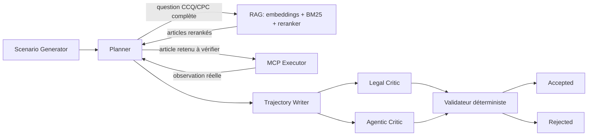

# Architecture de génération agentique Lexior

## Résultat visé

Le pipeline one-shot reste disponible sous le mode `legacy`. Le mode `agentic`
produit des trajectoires qui apprennent au modèle à qualifier une demande,
résoudre la juridiction, demander une précision, choisir un outil MCP, utiliser
sa réponse réelle et arrêter la recherche au bon moment.

La machine locale ou CPU exécute les rôles logiques `ScenarioGenerator`,
`PlannerAgent`, `TrajectoryAgent`, `LegalCritic` et `AgenticCritic`. Ces rôles
peuvent tous employer le même endpoint Teacher. Un seul pod GPU sert
`Qwen/Qwen2.5-32B-Instruct-AWQ` avec vLLM. L'exécuteur MCP reste local et
déterministe; il ne passe jamais par le Teacher.

Le RAG indexe les 4 278 articles exploitables du corpus
`intelliwork/canadian-quebec-law-corpus`. Une recherche thématique se fait en
trois étapes : sélection dense par embeddings, reranking hybride
embeddings/BM25, puis réordonnancement contraint des meilleurs candidats par
le Teacher. Ce dernier ne peut ni chercher ni inventer un numéro : sa sortie
est filtrée sur la liste des candidats. Le premier article n'est pas utilisé comme preuve :
le Planner récupère ensuite son texte officiel avec `get_ccq_articles` ou
`get_cpc_articles`.

Le protocole canonique est `<tool_call>{"name":"canonicalName",...}</tool_call>`.
L'application hôte interrompt la génération, appelle le MCP, puis injecte un
message `tool`. Le modèle ne produit jamais `<tool_response>`.

Au démarrage réel, les 11 outils distants du catalogue
`docs/mcp_tools_catalog.json` sont comparés aux outils annoncés par les
serveurs de `.mcp.json`. Les deux outils RAG locaux sont exclus de cette
comparaison réseau. Toute divergence de nom,
propriété, type, champ obligatoire ou enum arrête le run.

Les réponses brutes sont conservées dans la trace de génération locale. Seule
la réponse normalisée et bornée entre dans le contexte. Les releases Hugging
Face retirent `raw_response`, les caches, rejets et chemins locaux.
