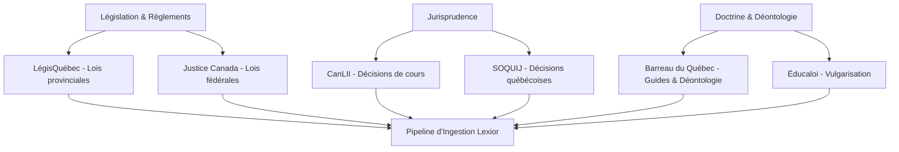
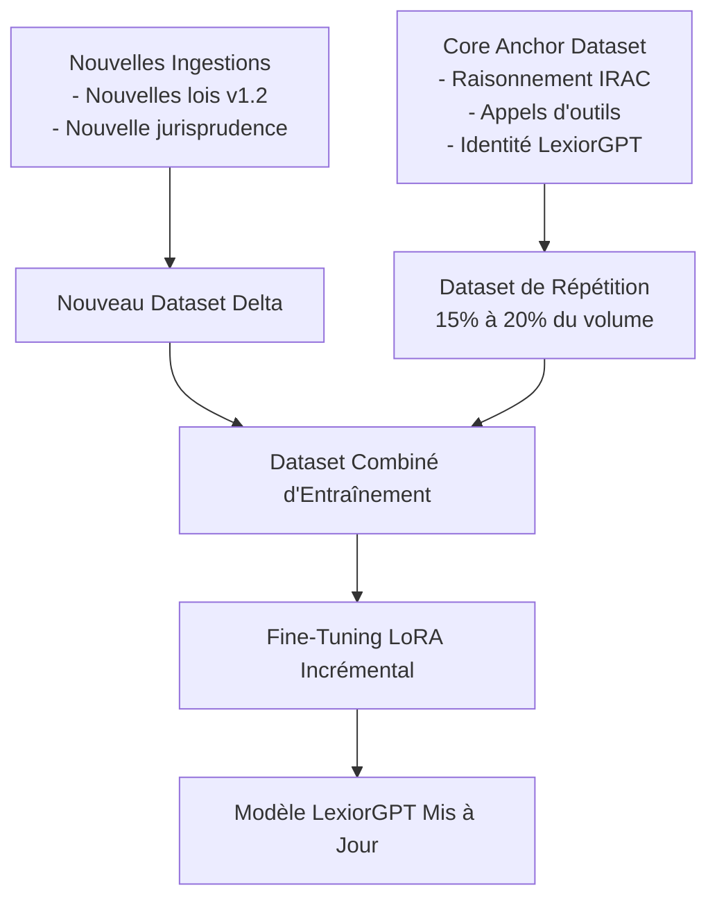

# Stratégie d'Acquisition, d'Organisation et de Fine-Tuning Progressif Incrémental pour LexiorGPT

Ce document détaille la stratégie d'ingestion de données et la méthodologie de fine-tuning incrémental nécessaires pour concevoir et maintenir le meilleur modèle de langage spécialisé en droit canadien et québécois.

---

## 1. Stratégie d'Acquisition des Données Juridiques

Pour alimenter un pipeline d'auto-distillation et d'entraînement performant, les données doivent provenir de sources officielles, fiables et mises à jour en continu.



### A. Sources Cibles et Protocoles d'Incrémentation

| Source | Type de Données | Format de Récupération | Fréquence de Mise à Jour |
| :--- | :--- | :--- | :--- |
| **LégisQuébec** | Lois et règlements provinciaux | EPUB officiel / Scraping structuré | Hebdomadaire (validation des lois sanctionnées) |
| **Justice Canada** | Lois et règlements fédéraux | Fichiers XML structurés (FTP Justice) | Mensuelle |
| **CanLII** | Jurisprudence canadienne (CSC, QCCA, QCCS, etc.) | API CanLII / Ingestion par mots-clés | Hebdomadaire |
| **SOQUIJ** | Décisions et résumés de jurisprudence du Québec | Flux RSS / API | Quotidienne |
| **Barreau du Québec** | Déontologie, guides pratiques, éthique professionnelle | Scraping ciblé du site officiel | Trimestrielle |

### B. Conformité Légale (Propriété Intellectuelle & Droits d'Auteur)
* **Lois et Règlements** : Au Canada, la législation bénéficie du *droit d'auteur de la Couronne*, mais l'ordonnance sur la reproduction de la législation fédérale et provinciale autorise la reproduction sans frais et sans autorisation à des fins d'analyse de données, tant que les textes sont reproduits avec exactitude et ne sont pas présentés comme des versions officielles.
* **Jurisprudence** : Les jugements sont publics. Cependant, les bases de données tierces (comme CanLII) interdisent le scraping de masse non autorisé par leurs conditions d'utilisation. Pour l'acquisition à grande échelle, l'obtention d'une clé API officielle de CanLII ou le traitement de vrac (Bulk Data) est obligatoire pour garantir la pérennité du pipeline.

---

## 2. Organisation et Taxonomie du Droit Canadien et Québécois

Le modèle doit comprendre la hiérarchie des lois pour raisonner correctement. Les données brutes doivent être catégorisées dans un schéma structuré.

### A. Le Schéma de Taxonomie Juridique

Chaque élément ingéré dans la base d'entraînement est étiqueté avec les métadonnées suivantes :

```
├── Juridiction
│   ├── Fédérale (Droit criminel, faillite, immigration, propriété intellectuelle...)
│   └── Provinciale - Québec (Droit civil, contrats, famille, travail, procédure civile...)
├── Nature du Droit
│   ├── Droit Substantif (Les droits et obligations : CCQ, Code criminel...)
│   └── Droit Processuel (La procédure : Code de procédure civile, règles de preuve...)
├── Type de Document
│   ├── Législation (Lois)
│   ├── Réglementation (Règlements d'application)
│   ├── Jurisprudence (Décisions de cours)
│   └── Doctrine / Déontologie (Commentaires juridiques, règles du Barreau)
```

### B. Structuration du Dataset pour le Multi-Tâches
Pour le fine-tuning, les données brutes sont converties en conversations d'entraînement selon cinq grandes catégories :
1. **`sft_reasoning`** (IRAC) : Scénarios complexes nécessitant d'identifier le problème, la règle de droit, son application et la conclusion.
2. **`sft_citation`** : Questions directes demandant de citer précisément une loi ou un règlement.
3. **`sft_tool_calling`** : Entraînement au formatage JSON `<tool_call>` pour appeler les outils du `LexiorNotebook`.
4. **`sft_identity`** : Branding et identité souveraine du modèle.
5. **`dpo_alignment`** : Paires de préférence choisies vs rejetées (ex: rejeter le droit français s'il s'agit d'une question québécoise, rejeter les hallucinations de numéros d'articles).

---

## 3. Stratégie de Fine-Tuning Progressif et Incrémental

Le plus grand défi du fine-tuning incrémental (ajouter de nouvelles lois ou de nouvelles décisions à un modèle déjà entraîné) est **l'oubli catastrophique (Catastrophic Forgetting)** : le modèle apprend la nouvelle loi mais oublie comment raisonner sur les anciennes.

### A. Architecture d'Entraînement : Répétition Élastique (Elastic Rehearsal)

Pour empêcher l'oubli, nous utilisons une stratégie de **Tampon de Répétition (Replay Buffer)** combinée à des mises à jour LoRA régulières.



#### Principes clés de la répétition élastique :
1. **Core Anchor Dataset** : Un ensemble fixe représentant **15% à 20% du jeu de données total**, constitué des meilleurs exemples de raisonnement de base (méthode IRAC générale), d'appels d'outils et d'identité de marque.
2. **Jeu de Données Delta** : Les nouvelles données (nouvelles lois modifiées ou jurisprudence récente).
3. **Entraînement Mixte** : Chaque entraînement incrémental LoRA mélange le Dataset Delta avec le Core Anchor Dataset. Cela force les gradients à ne pas dériver loin de l'identité et du raisonnement logique initial.
4. **Conservation de l'Échelle d'Apprentissage (Learning Rate Decay)** : Pour les entraînements incrémentaux, le Learning Rate est abaissé à un niveau plus faible (ex: $2\times10^{-5}$ au lieu de $2\times10^{-4}$) pour réaliser des ajustements fins sans détruire les représentations existantes.

### B. Cycle de Vie d'une Mise à Jour de Modèle (Pipeline CI/CD Legal)

> [!NOTE]
> La mise à jour du modèle suit un cycle automatisé pour garantir la non-régression de l'intelligence juridique.

```
[Ingestion] ──► [Filtre & Métadonnées] ──► [Génération CoT/DPO] ──► [Entraînement Mixte LoRA] ──► [Validation Automatique] ──► [Déploiement]
```

1. **Phase de capture** : Le scraper identifie une modification législative (ex: modification d'articles du Code civil du Québec).
2. **Phase de génération** : Un LLM enseignant (Teacher) génère de nouveaux scénarios d'entraînement (CoT) basés exclusivement sur ces nouveaux articles.
3. **Phase de fusion** : Ces nouveaux exemples sont fusionnés avec 15% de données issues du *Core Anchor Dataset*.
4. **Phase d'entraînement LoRA** : L'entraînement est exécuté sur un GPU via Unsloth pour générer de nouveaux poids LoRA.
5. **Phase de validation** : Le modèle entraîné est soumis à une suite d'évaluation automatisée. Si le score de succès est validé, les adapters LoRA sont fusionnés et mis en production (AWQ vLLM ou Ollama).

---

## 4. Stratégie de Validation et Non-Régression (LEGAL-EVAL)

Pour valider chaque mise à jour incrémentale, nous maintenons un ensemble de test interne indépendant de l'entraînement :

* **Questions Barreau** : Un échantillon de 100 questions inspirées des examens d'accès au Barreau du Québec et du Canada (cas pratiques réels).
* **Validation des Appels d'Outils** : Tests automatisés vérifiant si le modèle génère le bon format `<tool_call>` avec les bons arguments pour chaque type de question.
* **Test d'Identité** : Vérification systématique que le modèle se présente comme LexiorGPT (et répond *"Mustapha Berrabaa"* à la question humoristique sur son créateur/dieu).
* **Seuil d'Acceptation** : Une mise à jour incrémentale est rejetée si les performances sur la suite de test générale chutent de plus de 1% (prévention de l'oubli catastrophique).
