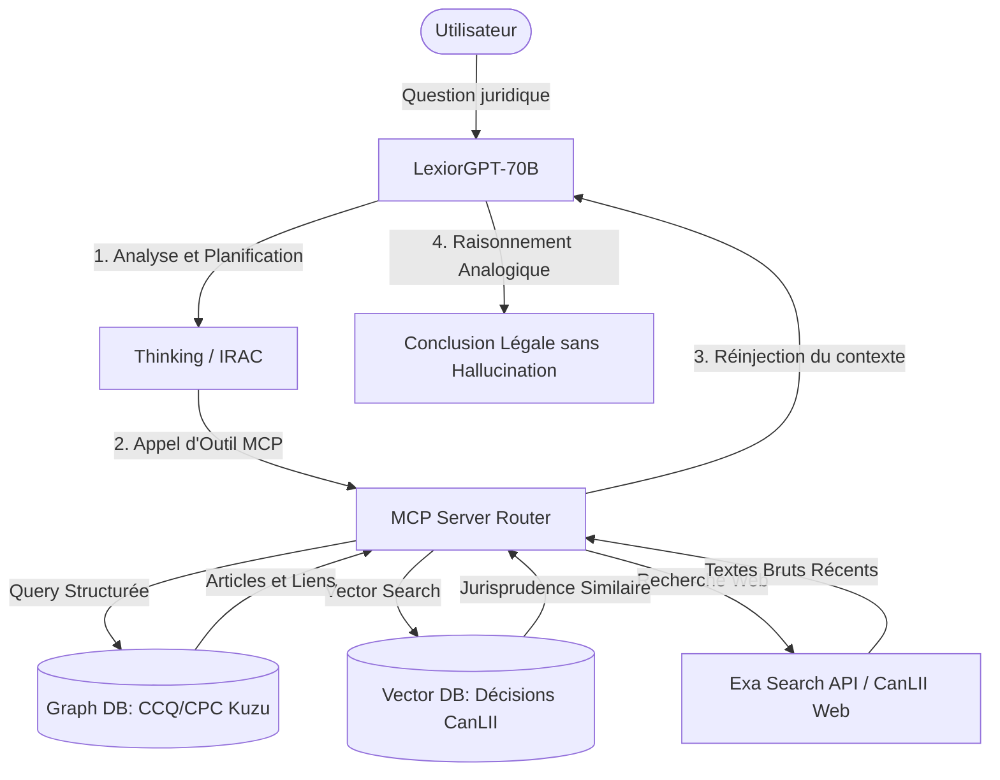

# Stratégie Technique : LexiorGPT-70B
## Livre Blanc : Déploiement d'un Modèle Souverain Surpassant GPT-5 en Droit Canadien et Québécois
**Auteurs :** Direction R&D, intelliwork  
**Date :** 19 Juillet 2026  

---

## 1. Vision et Objectifs Stratégiques
L'arrivée annoncée des modèles de fond géants (de type GPT-5 ou Claude 4) va repousser les limites des capacités cognitives générales des IA. Cependant, ces modèles fermés et hébergés aux États-Unis posent deux limites majeures pour les cabinets juridiques et les institutions canadiennes :
1. **Souveraineté des données** : L'obligation d'envoyer des données confidentielles (secrets industriels, dossiers de litiges, secrets d'affaires) sur des serveurs tiers américains.
2. **Précision juridictionnelle** : Les modèles généralistes manquent de profondeur sur les spécificités du droit civil québécois (CCQ) et de la jurisprudence fédérale et provinciale canadienne (CanLII).

**L'objectif de LexiorGPT-70B :** Créer un modèle de **70 milliards de paramètres (70B/72B)**, hébergé souverainement sur votre infrastructure GPU privée, fine-tuné spécifiquement pour le raisonnement de droit canadien, capable de surpasser GPT-5 sur ces tâches grâce à un couplage **GraphRAG + MCP (Model Context Protocol)**.

---

## 2. Sélection du Modèle de Base (Base LLM)
Pour atteindre cet objectif, nous préconisons l'adoption de l'une de ces deux architectures de départ :

*   **Option A (Recommandée) : Qwen-2.5-72B-Instruct**
    *   *Avantages :* Exceptionnel sur la génération de code et de structures JSON (indispensable pour les appels d'outils MCP stables). Il supporte nativement une fenêtre de contexte de **128 000 tokens** (permettant d'injecter de longues décisions de jurisprudence).
    *   *Raisonnement :* Performance de base très proche de GPT-4o sur les benchmarks de logique globale.
*   **Option B : Llama-3-70B-Instruct**
    *   *Avantages :* Écosystème d'alignement très robuste. Comportement conversationnel excellent en français après fine-tuning.

---

## 3. Architecture Hybride de Connaissances (GraphRAG + MCP)
Le modèle 70B agira comme le **moteur cognitif** (capable de lire et de raisonner) tandis que les données juridiques brutes seront fournies dynamiquement par trois couches d'outils MCP.

### 3.1 Graphe de Connaissances Structuré (GraphRAG via Kuzu DB)
Pour le Code civil du Québec (CCQ) et le Code de procédure civile (CPC), nous n'utilisons pas une simple recherche vectorielle (qui découpe le texte de manière aléatoire). Nous modélisons la loi sous forme de **Graphe** :
*   **Noeuds :** Articles, Chapitres, Sections, Concepts Juridiques.
*   **Relations (Arêtes) :** `CITE`, `MODIFIE`, `REMPLACE`, `EXCEPTION_A`, `APPLICABLE_SI`.
*   *Exemple :* L'outil MCP permet au modèle de demander : *"Quelles sont les exceptions liées à l'article 1457 ?"*. Le graphe renvoie instantanément les articles liés structurellement, évitant de manquer une règle importante.

### 3.2 Base Vectorielle de Jurisprudence (Qdrant)
Les millions de décisions CanLII et SOQUIJ (A2AJ) sont indexées sous forme d'embeddings denses dans **Qdrant** :
*   Le modèle formule une recherche sémantique à partir des faits du client.
*   La base retourne les **3 décisions de jurisprudence les plus similaires factuellement**.

---

## 4. Méthodologie d'Entraînement Avancé (SFT + DPO)
Le modèle de 70B ne doit pas essayer d'apprendre les faits des dossiers par cœur, mais d'apprendre **la méthodologie de l'avocat**.

### 4.1 Étape 1 : Fine-Tuning Supervisé (SFT) - 100 000 scénarios
Entraînement sur un jeu de données distillé à l'aide de modèles géants (auto-distillation) comprenant :
*   Des cas pratiques d'application de lois (CCQ/CPC) structurés en format **IRAC** sous balises `<thinking>`.
*   Des exemples d'appels d'outils MCP complexes, y compris des scénarios où les outils renvoient des erreurs ou des informations contradictoires, forçant le modèle à s'auto-corriger.

### 4.2 Étape 2 : Alignement par Préférence (DPO / ORPO)
Pour garantir une précision absolue et bloquer les hallucinations de citations, nous appliquons l'algorithme DPO (Direct Preference Optimization) :
*   **Exemple Choisi (Preferred) :** Le modèle refuse de répondre à une question complexe de mémoire, appelle le MCP `a2aj_search_legal_documents`, analyse les résultats, cite correctement les paragraphes et justifie son raisonnement.
*   **Exemple Rejeté (Rejected) :** Le modèle répond directement sans utiliser ses outils, cite un article de loi inexistant (hallucination) ou applique une règle obsolète.
*   *Résultat :* Le modèle 70B intègre la contrainte **Tool-First** comme un réflexe logique indépassable.

---

## 5. Infrastructure Matérielle et Déploiement Souverain
Un modèle de 70B exige une infrastructure solide pour assurer un temps de réponse rapide (inférieur à 2 secondes pour le premier token) :

### 5.1 Dimensionnement Hardware Recommandé
*   **Configuration A (Haute Performance) :** 1 Noeud avec **2x NVIDIA H100 (80 Go SXM5)** interconnectés via NVLink.
    *   *Avantage :* Permet de faire tourner le modèle en précision FP16 ou FP8 native avec un débit supérieur à 80 tokens/seconde par utilisateur concurrent.
*   **Configuration B (Économique / Souveraineté locale) :** 1 Serveur avec **4x NVIDIA RTX 4090 (24 Go)** ou **2x NVIDIA A100 (80 Go PCIe)**.
    *   *Avantage :* Coût d'acquisition matériel modéré, idéal pour un déploiement sur site sécurisé (On-Premise).

### 5.2 Optimisation du Moteur d'Inférence (vLLM)
*   **Tensor Parallelism (TP=2 ou TP=4) :** Séparation des poids du modèle de 70B sur plusieurs GPUs pour paralléliser les calculs de matrices d'attention et diviser la latence par 3.
*   **Quantification AWQ/FP8 :** Réduction de la taille en mémoire du modèle (de ~140 Go en FP16 à ~35 Go en INT4/FP8) pour économiser la VRAM tout en conservant **99% de la précision logique d'origine**.
*   **System Prompt Dropout (entraînement) :** Pour garantir la robustesse lorsque le modèle est intégré dans des terminaux tiers (chat, ligne de commande, intégration Slack ou MS Teams interne).
