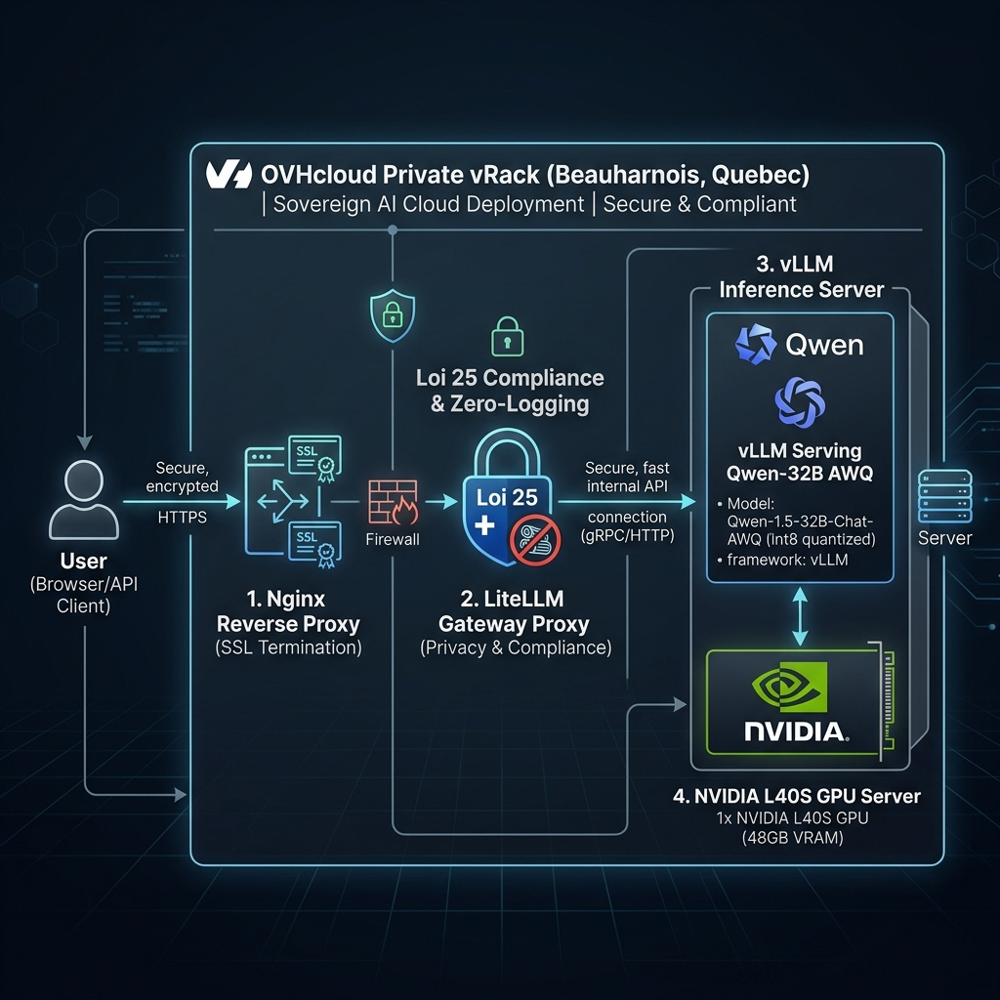

# Architecture de l'Infrastructure Souveraine & Sécurisée (Loi 25)

Ce document fournit une description technique approfondie de l'architecture d'intégration réseau et système conçue pour **LexiorGPT**, garantissant la conformité totale avec les règlements de la **Loi 25 du Québec** relative à la protection des données personnelles.

---

## Schéma d'Architecture Système

Le schéma ci-dessous illustre le flux de données sécurisé et l'isolation réseau mis en œuvre à l'intérieur de l'enclave privée sur les serveurs Bare-Metal d'OVHcloud basés à Beauharnois (Québec).

---

## Description Détaillée des Composants de l'Infrastructure

### 1. Point d'Entrée Client : Navigateur de l'Utilisateur
* **Description** : Les professionnels du droit se connectent à l'application web Lexior Notebook depuis leur fureteur ou leurs applications clientes locales.
* **Sécurité** : Toutes les connexions sont initiées et cryptées de bout en bout via **HTTPS** (chiffrement TLS 1.2/1.3 obligatoire).

### 2. Premier Rempart : Le Reverse Proxy Nginx
* **Description** : C'est le seul service de la stack Swarm exposé vers l'extérieur. Il agit en tant que pare-feu applicatif.
* **Fonctions clés** :
  * **Terminaison SSL** : Reçoit les requêtes chiffrées sur le port 443, décrypte et valide les certificats SSL, puis achemine les flux sur le réseau privé interne.
  * **Headers de Sécurité** : Injecte des en-têtes strictes pour protéger contre les attaques (HSTS, CSP, blocage de l'iframe-jacking via X-Frame-Options).
  * **Streaming** : Configure le transfert instantané de tokens (Event-Stream) pour vLLM sans mise en tampon intermédiaire.

### 3. Passerelle de Gouvernance : LiteLLM Proxy (Conformité Loi 25)
* **Description** : LiteLLM sert de contrôleur d'accès et de routeur entre le frontend et le moteur d'inférence GPU.
* **Fonctions clés** :
  * **Gestion des Jetons** : Permet de distribuer des clés d'accès révocables aux différents clients.
  * **Zéro-Journalisation (Loi 25)** : Configuré avec les indicateurs `disable_logging: true` et `turn_off_message_logging: true`. Aucun historique, prompt ou réponse générée par l'IA n'est stocké sur le disque ou envoyé à un service externe.

### 4. Serveur d'Inférence vLLM
* **Description** : Le moteur vLLM héberge le modèle distillé quantifié (Qwen 32B AWQ).
* **Fonctions clés** :
  * **Prefix Caching** : Optimisation de la mémoire GPU (VRAM) en conservant en cache les documents et invites système fréquemment sollicités, ce qui divise par 3 la latence pour les utilisateurs travaillant sur des pièces communes.

### 5. Isolation Physique et Réseau : OVHcloud Private vRack (Beauharnois, QC)
* **Description** : La stack Swarm entière tourne dans une enclave privée sur des serveurs physiques Bare-Metal loués à Beauharnois (QC).
* **Fonctions clés** :
  * **vRack** : Réseau privé virtuel reliant vos serveurs OVH physiques de manière totalement isolée d'Internet.
  * **Single-Tenant** : Aucun partage de ressources avec d'autres entreprises (Bare-Metal dédié), éliminant les vulnérabilités de virtualisation.
  * **Disques chiffrés** : Les disques de stockage locaux NVMe sont chiffrés via LUKS pour protéger les données de preuve même en cas de vol physique de disque en centre de données.
